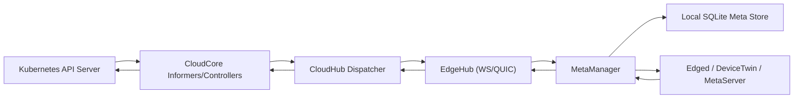

# Why KubeEdge Can Manage More Worker Nodes Than Standard Kubernetes

## Audience and intent

This report explains, in detail and in plain language, **why KubeEdge can usually support far more edge worker nodes than a standard Kubernetes-only architecture**, based on code analysis of this repository.

If you are new to KubeEdge, the short version is:

- Standard Kubernetes assumes every node talks directly to the control plane for most state operations.
- KubeEdge introduces a **cloud-edge message layer** and **edge-local metadata/cache services**.
- This reduces central API-server fan-out pressure and lets edge nodes run with more autonomy during bad or intermittent links.

---

## Executive summary (non-technical)

KubeEdge scales edge fleets by changing the communication model:

1. **Cloud side** watches cluster state once, then sends only node-targeted updates.
2. **CloudHub** maintains per-node sessions and queues so noisy nodes do not block healthy ones.
3. **Edge side** stores and serves much of the needed state locally (SQLite + MetaManager/MetaServer).
4. **Reliable sync checkpoints** prevent unnecessary resends and support eventual convergence.
5. **Config defaults scale with NodeLimit**, increasing worker pools and buffers as configured node count grows.

Net effect: compared with direct kubelet↔apiserver traffic patterns, KubeEdge reduces central bottlenecks and tolerates unstable networks better.

---

## First, what limits scaling in standard Kubernetes?

In a traditional cluster, every worker kubelet interacts with the API server for:

- status updates,
- object watches/lists,
- heartbeats/leases,
- secret/config retrieval,
- pod lifecycle feedback.

As node count rises, the control plane has to process much more watch traffic, update churn, and connection maintenance. Horizontal scaling helps, but the interaction pattern remains control-plane heavy.

KubeEdge changes this pattern by inserting cloud-edge modules that aggregate, target, and cache state.

---

## KubeEdge architecture path relevant to scaling

Key point: edge nodes do not need to repeatedly query the central control plane for many common reads; KubeEdge can satisfy many operations at the edge.

---

## Finding 1: KubeEdge narrows control-plane scope to edge-relevant nodes and resources

### 1.1 Edge node filtering at informer level

KubeEdge creates a dedicated edge-node informer filtered by edge role label:

- `node-role.kubernetes.io/edge` is the selector key (`common/constants/default.go`).
- Filtered node watch created in `cloud/pkg/common/informers/informer_manager.go`.

This avoids treating all cluster nodes equally in edge control flows.

### 1.2 Pod updates only sent for edge nodes

In downstream sync, pod events are ignored unless the pod is bound to an edge node:

- check: `if !dc.lc.IsEdgeNode(pod.Spec.NodeName) { continue }` in `cloud/pkg/edgecontroller/controller/downstream.go`.

### 1.3 Secret/ConfigMap fan-out only to dependent nodes

LocationCache tracks which nodes actually reference each ConfigMap/Secret:

- `ConfigMapNodes(...)` and `SecretNodes(...)` in `cloud/pkg/edgecontroller/manager/location.go`.
- Downstream loops send to only those nodes in `cloud/pkg/edgecontroller/controller/downstream.go`.

Why this matters: when a ConfigMap changes, KubeEdge does not blindly push to every edge node.

---

## Finding 2: CloudHub acts as a scalable session broker instead of direct apiserver fan-out

CloudHub creates and manages node sessions with explicit limits and liveness handling:

- Node limit enforced via `SessionManager.ReachLimit()` in `cloud/pkg/cloudhub/session/session_manager.go`.
- Limit checked on connection in `cloud/pkg/cloudhub/handler/message_handler.go`.
- Per-node session started on connect and cleaned on disconnect in `cloud/pkg/cloudhub/handler/message_handler.go`.

Per-node session model provides operational isolation:

- each node has its own message queues and keepalive cycle,
- one stalled/unstable node does not block global dispatch.

CloudHub transport options:

- supports WebSocket and QUIC server startup in `cloud/pkg/cloudhub/servers/server.go`.

---

## Finding 3: Per-node queueing + ACK strategy reduces duplicated work and improves resilience

### 3.1 Two queue classes per node

Each node gets a `NodeMessagePool` with:

- ACK store/queue,
- NO-ACK store/queue,

implemented in `cloud/pkg/cloudhub/common/message_pool.go`.

### 3.2 Downstream messages are categorized

Dispatcher splits by `noAckRequired(...)` in `cloud/pkg/cloudhub/dispatcher/message_dispatcher.go`:

- low-risk/response classes can be NO-ACK,
- state-critical classes use ACK.

### 3.3 ACK queue deduplicates by resourceVersion

`enqueueAckMessage(...)` discards stale updates if an equal/newer version is already queued or persisted in sync objects:

- see version comparison path in `cloud/pkg/cloudhub/dispatcher/message_dispatcher.go`.

### 3.4 Retries are bounded and rate-limited

Node session ACK send path retries on timeout and rate-limits requeue:

- send/retry logic in `cloud/pkg/cloudhub/session/node_session.go`.

This prevents unlimited immediate retry storms while preserving eventual delivery intent.

---

## Finding 4: ReliableSync objects (`ObjectSync`, `ClusterObjectSync`) act as convergence checkpoints

KubeEdge stores edge delivery progress in CRDs:

- message dispatcher creates/updates sync objects when first seen (`cloud/pkg/cloudhub/dispatcher/message_dispatcher.go`),
- node session updates success points after ACK (`cloud/pkg/cloudhub/session/node_session.go`),
- synccontroller periodically reconciles and only re-sends when edge is behind (`cloud/pkg/synccontroller/objectsync.go`, `cloud/pkg/synccontroller/clusterobjectsync.go`).

Why this matters:

- supports eventual convergence after disconnects,
- avoids blind full replay of all resources,
- ties retries to explicit version checkpoints.

---

## Finding 5: Edge autonomy via local SQLite cache drastically reduces cloud dependency for reads

MetaManager stores object content into local DB on insert/update/response paths:

- DB write paths in `edge/pkg/metamanager/process.go` and DAO in `edge/pkg/metamanager/dao/meta.go`.

For query operations:

- if resource requires remote and link is up, it can query cloud,
- otherwise it serves from local DB.

The decision is explicit:

- `requireRemoteQuery(...)` and connectivity checks in `edge/pkg/metamanager/process.go`.

This is a major scaling advantage in weak networks:

- edge-side consumers can continue reading local state,
- central cloud is not hit for every lookup,
- temporary disconnect does not immediately break all control loops.

---

## Finding 6: Optional local MetaServer provides Kubernetes-like get/list/watch from local storage

When enabled, MetaServer starts on edge and serves API-like operations locally:

- start path in `edge/pkg/metamanager/metamanager.go` and `edge/pkg/metamanager/metaserver/server.go`.
- storage backend is SQLite-based store and watcher:
  - `edge/pkg/metamanager/metaserver/kubernetes/storage/sqlite/store.go`
  - `edge/pkg/metamanager/metaserver/kubernetes/storage/sqlite/watcher.go`

Meaning: components/tools interacting with edge can use local list/watch behavior without always traversing to cloud.

---

## Finding 7: KubeEdge explicitly ties concurrency and buffers to expected node scale

CloudCore defaults and adjustment logic scale several knobs with `NodeLimit`:

- CloudHub `NodeLimit`, keepalive defaults in `staging/src/github.com/kubeedge/api/apis/componentconfig/cloudcore/v1alpha1/default.go`.
- `KubeAPIConfig.QPS = 5 * nodeLimit`, `Burst = 10 * nodeLimit`.
- Worker counts scaled to node limit (`QueryNodeWorkers`, `CreateLeaseWorkers`).
- Buffer sizes scaled (`QueryNode`, `CreateLease`, `PatchNode`).

This is not accidental; code comments explicitly connect node limit to upstream goroutine load.

---

## Finding 8: EdgeHub includes built-in flow control and reconnection behavior

EdgeHub uses token-bucket throttling for messages sent cloudward:

- configured by `MessageQPS` / `MessageBurst` in edge config defaults,
- enforced in `edge/pkg/edgehub/process.go` (`tryThrottle`).

It also has explicit reconnect and keepalive loops:

- connection init/reconnect cycle in `edge/pkg/edgehub/edgehub.go`,
- periodic keepalive in `edge/pkg/edgehub/process.go`.

This reduces overload spikes and keeps link behavior predictable under pressure.

---

## End-to-end examples (how this plays out)

### Example A: Pod update for an edge node

1. Cloud side informer observes pod change once.
2. Downstream controller ignores non-edge nodes and builds `node/<id>/...` resource key.
3. CloudHub queues node-targeted message.
4. ACK path dedupes stale versions.
5. EdgeHub receives and dispatches to MetaManager/Edged.
6. MetaManager persists metadata locally.
7. ACK updates reliable sync checkpoint.

Result: targeted delivery with replay protection and local persistence.

### Example B: ConfigMap update

1. ConfigMap event arrives in cloud.
2. LocationCache maps configmap to only nodes with pods that reference it.
3. Message sent only to those nodes.

Result: avoids O(N-edge-nodes) fan-out when unnecessary.

### Example C: Cloud link interruption

1. EdgeHub marks disconnected and starts reconnect loop.
2. MetaManager can still satisfy many reads from local DB.
3. On reconnect, reliable sync + version checks converge drift.

Result: edge continues functioning with degraded but not collapsed control behavior.

---

## Why this is better than plain Kubernetes for large edge fleets

| Dimension | Standard Kubernetes | KubeEdge approach |
|---|---|---|
| Node-control-plane interaction | Direct kubelet↔apiserver heavy at scale | CloudHub broker + node-targeted messaging |
| Secret/ConfigMap fan-out | Broad watch/list semantics | Dependency-aware node subset fan-out |
| Offline behavior | Limited; many operations blocked | Local MetaManager/SQLite/MetaServer read paths |
| Retry semantics | Controller dependent | Explicit per-node ACK queue + reliable sync checkpoints |
| Scale tuning | Generic API server tuning | NodeLimit-driven worker and buffer scaling |

---

## Trade-offs and caveats

KubeEdge’s scalability gains come with complexity trade-offs:

1. **More moving parts**: CloudHub, EdgeController, SyncController, MetaManager, optional MetaServer.
2. **Eventual consistency model**: edge can run on cached state; strongest freshness is not guaranteed during disconnection.
3. **CRD overhead**: ReliableSync CRDs add control-plane objects and reconciliation work.
4. **Per-node session memory/queue footprint**: CloudHub still holds state per connected edge node.
5. **Operational tuning needed**: `NodeLimit`, worker counts, and queue depths should match real workload patterns.

So, KubeEdge is usually better for large, unstable edge fleets, but it is not “free scaling”; it is a different architecture with different operational responsibilities.

---

## Practical tuning checklist (starting point)

1. Set realistic `CloudHub.NodeLimit` for each CloudCore instance.
2. Verify auto-adjusted `KubeAPIConfig.QPS/Burst` and EdgeController worker/buffer settings.
3. Ensure edge-node labeling (`node-role.kubernetes.io/edge`) is consistent so filtering works.
4. Monitor CloudHub connected sessions and message queue behavior.
5. Tune edge `MessageQPS/MessageBurst` to avoid burst overload toward cloud.
6. Validate reconnection and convergence behavior under packet loss/high latency.
7. For read-heavy edge workloads, consider enabling and sizing MetaServer/local storage appropriately.

---

## Bottom line

KubeEdge scales beyond standard Kubernetes worker patterns primarily because it:

- **centralizes watch fan-in on cloud side**,
- **targets fan-out by node/resource dependency**,
- **uses per-node queue/session isolation**,
- **adds reliability checkpoints**, and
- **pushes read/state handling to edge-local persistence**.

This architecture is specifically designed for edge realities (large node counts, unstable links, autonomous operation), which is why it can manage significantly more workers in those environments.

